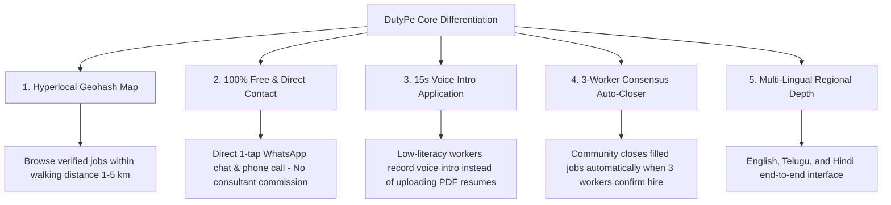

# DutyPe: Google Play App Quality, Ranking & Discovery Master Blueprint

> **Based on Official Google Play Guidelines & Android Developer Policies:**
> 1. [Build a High-Quality App or Game (Google Play Console Guide)](https://play.google.com/console/about/guides/build-a-high-quality-app-or-game/)
> 2. [Improved App Quality and Discovery on Google Play (Android Developers Blog 2019)](https://android-developers.googleblog.com/2019/06/improved-app-quality-and-discovery-on.html)
> 3. [Updated Guidance to Improve Your App Quality and Discovery on Google Play (Android Developers Blog 2021)](https://android-developers.googleblog.com/2021/04/updated-guidance-to-improve-your-app.html)
> 4. [Core App Quality Guidelines (Android Developers)](https://developer.android.com/docs/quality-guidelines/core-app-quality)
> 5. [Store Listing Preview Assets Guidelines (Google Play Console Help)](https://support.google.com/googleplay/android-developer/answer/9866151)
> 6. [Android Vitals & Bad Behavior Thresholds](https://support.google.com/googleplay/android-developer/answer/7385505)

---

## Executive Summary: The Google Play Discovery Engine

Google Play is no longer just a digital distribution catalog; it is an **algorithmic curation engine**. With over 2 billion monthly active users across 190 countries, Google Play prioritizes apps that demonstrate **high technical stability**, **delightful and intuitive user experiences**, **policy-compliant store listing metadata**, and **sustained user retention**.

Apps that violate technical thresholds (poor Android Vitals) or employ misleading, keyword-stuffed metadata are systematically **downranked, filtered out of category clusters, and disqualified from organic featuring** (such as "Apps We Love", "Trending", and Home screen recommendations). Conversely, apps that achieve top-tier Android Vitals, localize authentically, maintain active release cadences, and convert listing visits into long-term active users receive exponential organic discovery in Search and Browse.

This document details an end-to-end operational roadmap for **DutyPe** to stand out, rank #1 for local hiring/job searches, maximize store conversion, and sustain a high-quality reputation on Google Play.

---

## 1. Technical Quality & Android Vitals: The Ranking Foundation

Google's 2019 ranking overhaul established that **technical performance directly determines discovery eligibility**. 42% of 1-star reviews on Google Play cite crashes or performance bugs. If an app exceeds the "Bad Behavior Threshold" in Android Vitals, Google Play restricts its visibility across all surfaces.

### 1.1 Core Vitals Metrics & Target Benchmarks

| Metric | Google Play Bad Behavior Threshold | DutyPe Target | DutyPe Current Implementation & Guardrails |
| :--- | :--- | :--- | :--- |
| **User-Perceived Crash Rate** | **> 1.09%** | **< 0.15%** | Protected by Firebase Crashlytics, strict coroutine exception handlers, and fallback UI states in Jetpack Compose. |
| **User-Perceived ANR Rate** | **> 0.47%** | **< 0.05%** | `MainThreadChecker` and `ANRHandler` installed; all Firestore I/O, crypto, and disk operations strictly offloaded to `Dispatchers.IO`. |
| **Excessive Wakeups** | **> 10 / hour** | **0 / hour** | Smart notification alarms eliminated from client; periodic triggers migrated to Firebase Cloud Functions server-side. |
| **Stuck Background Wake Locks** | **> 1 hour in background** | **0%** | Replaced custom background wake locks with WorkManager scheduled jobs; jobs yield within seconds. |
| **Slow Rendering (> 16ms frames)** | **> 50% of frames** | **< 10%** | Jetpack Compose compiler metrics tuned; Compose Baseline Profiles pre-compiled in release AAB. |
| **Frozen Frames (> 700ms)** | **> 0.10% of frames** | **< 0.01%** | Shimmer skeleton loading components used instead of blocking thread execution during network fetch. |

### 1.2 App Size & Low-RAM Optimization (Targeting Indian Budget & Android Go Devices)
In India, blue-collar workers and small business employers predominantly use budget smartphones (e.g., 2GB-3GB RAM, Android Go Edition, 32-bit ARM).
- **16KB ELF Page Size Support**: DutyPe already has `VerifyNative16KbPageSizeTask` configured for Android 15+ 16KB page support, ensuring forward compatibility.
- **R8 ApplyMapping for Patch Size**: Configured with `-applymapping` using baseline release mappings. When users update DutyPe on Google Play, Google generates binary delta patches of only **1 to 2 MB** instead of redownloading the full APK, drastically reducing update churn and uninstalls.
- **Coil Image Memory Caps**: `DutyPeApplication.kt` bounds Coil image memory cache to prevent Out-Of-Memory (OOM) crashes on low-RAM devices.
- **Critical Gradle Resource Config Fix**:
  > **Actionable Finding**: In `app/build.gradle.kts`, line 63 was previously set to:
  > ```kotlin
  > resourceConfigurations += listOf("en", "te")
  > ```
  > Since Hindi (`values-hi`) has been fully translated with 1,600+ localized strings, keeping only `"en"` and `"te"` causes aapt to strip Hindi resources from the final release APK/AAB!
  > **Solution**: Update to:
  > ```kotlin
  > resourceConfigurations += listOf("en", "te", "hi")
  > ```

---

## 2. Adding Depth to DutyPe: Stand Out From Competitors

Google Play advises: *"Provide the right type and amount of content in your app to nurture a growing user base. Help your app stand out by providing a unique or innovative solution."*

Most job apps in India (Apna, WorkIndia, Indeed) are generic job boards that suffer from ghost employers, consultant fees, and slow hiring cycles. DutyPe stands out through five core differentiating pillars:



### 2.1 Regional Pricing & Transparency
- **Worker Zero-Fee Guarantee**: Zero fees for workers, guaranteed in-app. Blue-collar workers are frequently scammed by fake agencies charging "registration fees". DutyPe explicitly displays verification shields and scam warnings.
- **Employer Value-Based Model**: Transparent pricing for urgent hiring, with clear trial allocations and local payment rails (UPI, QR verification).

### 2.2 Community Nurturing & User-Generated Content (UGC)
- **Truecaller-Style Employer Passbook**: Employers see worker profile history, peer reviews, and call updates (`CallUpdateBottomSheet.kt`).
- **In-App WhatsApp Communities**: Integrated `DutyPeWhatsAppCommunityCard.kt` connects local workers in specific hubs (Hyderabad, Secunderabad, Cyberabad).
- **Consensus-Driven Job Verification**: Automatically keeps listings fresh by leveraging worker feedback ("Position Filled / Stop Calls"), preventing stale listings.

### 2.3 Testing Infrastructure: Closed & Open Testing
Google requires new personal developer accounts to run a **closed test with at least 20 testers for 14 days** before applying for production access.
- **Closed Testing Track**: Set up an internal/closed testing ring of 25–30 real workers and employers across Hyderabad/Telangana.
- **Pre-Launch Reports (PLR)**: Before every production release, review Google's automated test runs across physical devices in the Firebase Test Lab. Check for:
  - Layout cut-offs on different screen aspect ratios (18:9, 19.5:9, 20:9).
  - Accessibility contrast ratios and touch target sizes (minimum 48x48dp).
  - Memory spikes during map rendering and voice recording.

---

## 3. Engaging Users & Sustaining Long-Term Retention

Google Play favors apps that keep users engaged over time and maintain high active retention.

### 3.1 Consistent Release Cadence & Content Refreshes
- **Bi-Weekly Updates**: Google Play algorithms favor apps with regular release cadences (every 2 to 4 weeks) as a signal of active maintenance.
- **Localized Release Notes (`default.txt`)**: Always supply release notes in all 3 supported languages:
  - `app/src/main/play/release-notes/en-US/default.txt`
  - `app/src/main/play/release-notes/te-IN/default.txt`
  - `app/src/main/play/release-notes/hi-IN/default.txt`
- Clear, user-friendly notes detailing new features (e.g., "Added Voice Intro for faster applications", "Faster local map search") instead of generic "bug fixes".

### 3.2 Premium Ad Experience: The 100% Ad-Free Advantage
Google’s Better Ads Standards penalize apps that show unexpected full-screen interstitials, ads on launch, or disruptive banners.
- **DutyPe Android is 100% Ad-Free**: DutyPe contains no AdMob banner, interstitial, or rewarded ads.
- **Marketing & Trust Advantage**: Highlight this directly in the Store Listing: *"100% Ad-Free Experience — No spam ads or popup interruptions."*

### 3.3 Sentiment & Ratings Strategy (+0.7 Star Boost)
Google's ranking algorithm places the greatest weight on **recent ratings** rather than lifetime ratings.
- **In-App Review API Integration (`InAppReviewManager.kt`)**: Prompts users at natural moments of accomplishment:
  1. Worker: After successfully submitting their first job application.
  2. Employer: After posting their first job or verifying a worker hire.
  3. Never prompt on app launch, error states, or repeatedly within 30 days.
- **Developer Review Reply Protocol**: Google research shows that **replying to negative user reviews increases the user's rating by an average of +0.7 stars**.
  - Respond to all 1-star, 2-star, and 3-star reviews within 24 hours.
  - Offer direct support via Telugu/Hindi WhatsApp support (`+91-8500717800`).

---

## 4. Google Play Store Listing & Metadata Compliance (2021+ Policy)

Google Play enforces strict metadata policies announced in 2021:
- **Title**: Limited to **30 characters max**.
- **Prohibited**: Capitalized spam, emojis, punctuation spam (`???`, `!!!`), and performance/promotional buzzwords like *"Free"*, *"Best"*, *"#1"*, *"Top"*, *"Download Now"*.
- **Short Description**: Limited to **80 characters max**. Must clearly describe what the app does without promotional fluff.
- **Full Description**: Clear structure, natural keyword usage, transparent features.

### 4.1 Metadata Audit & Recommended Copy

#### English (en-US)
| Field | Current Status | Character Count | Compliance Audit | Recommended Optimized Copy |
| :--- | :--- | :--- | :--- | :--- |
| **App Title** | `DutyPe: Local Jobs & Hiring` | 27 / 30 | ✅ Compliant, high keyword relevance | `DutyPe: Local Jobs & Hiring` |
| **Short Description** | `Find daily jobs near you. Hire verified workers in minutes. Free for all.` | 74 / 80 | ⚠️ *"Free for all"* contains promotional buzzword "Free" flagged by 2021 guidelines | `Find local jobs near you. Direct employer calls & WhatsApp. Hire in minutes.` (78 chars) |

#### Telugu (te-IN)
| Field | Current Status | Character Count | Compliance Audit | Recommended Optimized Copy |
| :--- | :--- | :--- | :--- | :--- |
| **App Title** | `DutyPe: లోకల్ ఉద్యోగాలు` | 24 / 30 | ✅ Compliant & natural Telugu | `DutyPe: లోకల్ ఉద్యోగాలు` |
| **Short Description** | `మీ దగ్గర రోజువారీ ఉద్యోగాలు. వెరిఫైడ్ వర్కర్‌లను నిమిషాల్లో నియమించండి.` | 71 / 80 | ✅ Fully compliant, high clarity | `మీ దగ్గర రోజువారీ ఉద్యోగాలు. వెరిఫైడ్ వర్కర్‌లను నిమిషాల్లో నియమించండి.` (71 chars) |

#### Hindi (hi-IN)
| Field | Current Status | Character Count | Compliance Audit | Recommended Optimized Copy |
| :--- | :--- | :--- | :--- | :--- |
| **App Title** | `DutyPe: नौकरी और हायरिंग ऐप` | 24 / 30 | ✅ Compliant & high search volume | `DutyPe: नौकरी और हायरिंग ऐप` |
| **Short Description** | `अपने पास रोज़ाना नौकरियाँ पाएं। वेरिफाइड वर्कर्स को मिनटों में हायर करें।` | 71 / 80 | ✅ Fully compliant | `अपने पास रोज़ाना नौकरियाँ पाएं। वेरिफाइड वर्कर्स को मिनटों में हायर करें।` (71 chars) |

---

## 5. Visual Asset Guidelines: Icon, Feature Graphic, Screenshots & Video

Google Play's preview asset guidelines dictate whether an app is eligible for featuring on the Play Store Home and category hubs.

```
+-----------------------------------------------------------------------------------+
|                            FEATURE GRAPHIC (1024 x 500)                           |
|  [ 15% Safe Margin ]                                         [ 15% Safe Margin ]  |
|                     +-----------------------------------+                         |
|                     |     Center 70% Visual Core:       |                         |
|                     |   Brand Logo + Clean Tagline      |                         |
|                     |  (No Store Badges, No Buzzwords)  |                         |
|                     +-----------------------------------+                         |
+-----------------------------------------------------------------------------------+
```

### 5.1 App Icon (512 x 512 PNG, 32-bit)
- **Brand Consistency**: Uses the verified black-based DutyPe launcher icon.
- **No Promotional Badges**: Free of "NEW", "SALE", or ranking badges.
- **High Contrast**: Clean circular/squircle foreground visible against both light and dark Android system themes.

### 5.2 Feature Graphic (1024 x 500 PNG / JPEG)
- **Aspect Ratio**: 1024 × 500 pixels.
- **Safe Zone Rule**: Google Play crops borders depending on screen format. Keep all essential branding, illustrations, and typography within the **central 70% area** (leave 75px margin on top/bottom, 150px on left/right).
- **Video Cover**: Acts as the default thumbnail when a preview video is linked.
- **No Badges**: Do not display "Google Play" badges, download counters, or rating stars.

### 5.3 Screenshots (8-Slot Master Strategy)
- **Resolution**: 1080 × 1920 pixels (9:16 portrait).
- **Core Rule**: First 3 screenshots must demonstrate **actual in-app UI** rather than abstract conceptual art.
- **Accessibility**: Provide descriptive **Alt Text** for every screenshot in Play Console.

#### 8-Slot Visual Journey:
1. **Slot 1 (Hero - Map Discovery)**: Real Compose UI of the nearest jobs map with 1 km / 5 km radius pins. Headline: *"Find Jobs Within Walking Distance"*.
2. **Slot 2 (Direct Contact)**: Job detail screen showing 1-tap WhatsApp and direct Call buttons. Headline: *"Direct Call & WhatsApp — Zero Commission"*.
3. **Slot 3 (Voice Intro)**: 15-second audio recorder screen. Headline: *"Apply in 15 Seconds with Your Voice"*.
4. **Slot 4 (Diverse Categories)**: Job category grid (Cook, Maid, Driver, Delivery, Security, Helper). Headline: *"Daily, Monthly & Urgent Work"*.
5. **Slot 5 (Employer Fast Post)**: 2-minute job posting UI with instant salary & location selector. Headline: *"Post a Job in 2 Minutes"*.
6. **Slot 6 (Applicant Management)**: Candidate passbook with Truecaller-style verification and audio intro playback. Headline: *"Review Candidates & Audio Intros"*.
7. **Slot 7 (Consensus & Verification)**: QR code check-in and 3-worker consensus status. Headline: *"Verified Attendance & Fast Hiring"*.
8. **Slot 8 (Local Language)**: Language selection screen showing English, Telugu, and Hindi. Headline: *"Available in English, తెలుగు & हिंदी"*.

### 5.4 Preview Video (YouTube)
- **Duration**: 25–30 seconds (Google autoplays the first 30s with muted audio).
- **Settings**: Upload to YouTube as **Public or Unlisted**, with **monetization disabled** (ads in preview videos violate Play policy).
- **Visual Composition**:
  - 80%+ screencast of the actual DutyPe app in action.
  - Large, bold caption overlays explaining the actions (since audio starts muted).
  - Portrait orientation (no black bars on the sides).

---

## 6. Play Console Discovery & Growth Tools (ASO & Experiments)

### 6.1 Custom Store Listings (CSL)
Google Play allows creating up to 50 Custom Store Listings tailored by country or install state.
- **CSL 1 (Telangana & Andhra Pradesh)**:
  - Target: Andhra Pradesh & Telangana users.
  - Assets: Telugu-first screenshots, Telugu headlines, emphasizing Hyderabad, Secunderabad, Warangal, Vijayawada, and Visakhapatnam.
- **CSL 2 (Rest of India - North & West Focus)**:
  - Target: Rest of India.
  - Assets: Hindi & English screenshots, highlighting Pune, Delhi NCR, and nationwide local opportunities.
- **CSL 3 (Re-Engagement for Lapsed Users)**:
  - Custom listing targeting users who uninstalled or haven't opened the app in 30+ days, highlighting recent updates ("New Voice Intro", "More verified jobs near you").

### 6.2 Store Listing Experiments (A/B Testing Protocol)
Never make permanent store listing changes without testing them against live traffic.
- **Test 1 Variable at a Time**:
  - Phase 1: Test Icon (Black minimalist logo vs. Badge variant). Run for 7–14 days.
  - Phase 2: Test Screenshot Order (Map discovery first vs. Direct WhatsApp call first).
  - Phase 3: Test Short Description wording.
- **Statistical Significance**: Aim for > 90% confidence interval with at least 500–1,000 installs per test arm before adopting the winner.

---

## 7. Immediate Priority Action Checklist

### Phase 1: Codebase & Packaging Fixes (Immediate)
- [x] **Restore Black-Based Android Icons**: Complete (reverted from HEAD, clean mipmap buckets).
- [x] **Synchronize Web Assets**: Complete (`webappicon.png` & `icon.webp` updated from black-based master).
- [ ] **Fix Hindi Resource Packaging**: Update `resourceConfigurations` in `app/build.gradle.kts`:
  ```kotlin
  // Add "hi" so Hindi translations are not stripped from release APK/AAB
  resourceConfigurations += listOf("en", "te", "hi")
  ```
- [ ] **Clean English Short Description**: Update `app/src/main/play/listings/en-US/short-description.txt` to remove the buzzword *"Free for all"* to ensure 100% 2021 asset policy compliance.

### Phase 2: Creative & Store Listing Production
- [ ] **Export 1080x1920 Screenshots**: Generate the 8 localized screenshots for English, Telugu, and Hindi in `app/src/main/play/listings/`.
- [ ] **Feature Graphic (1024x500)**: Create the complementary branding banner with the 15% edge safety margin.
- [ ] **30s Preview Video**: Record and publish a 30s muted walkthrough video showing map discovery and voice intro application on YouTube.

### Phase 3: Play Console Setup & Growth Execution
- [ ] **Set Up Custom Store Listings**: Configure Telugu CSL for Telangana/AP and Hindi/English CSL for other states.
- [ ] **Activate Store Listing Experiments**: Run A/B test on Feature Graphic and Short Description.
- [ ] **Monitor Android Vitals Dashboard**: Verify Crash Rate (< 0.15%) and ANR Rate (< 0.05%) in Play Console.
- [ ] **Establish Review Response SLA**: Reply to all user reviews within 24 hours to gain the +0.7 star rating boost.
