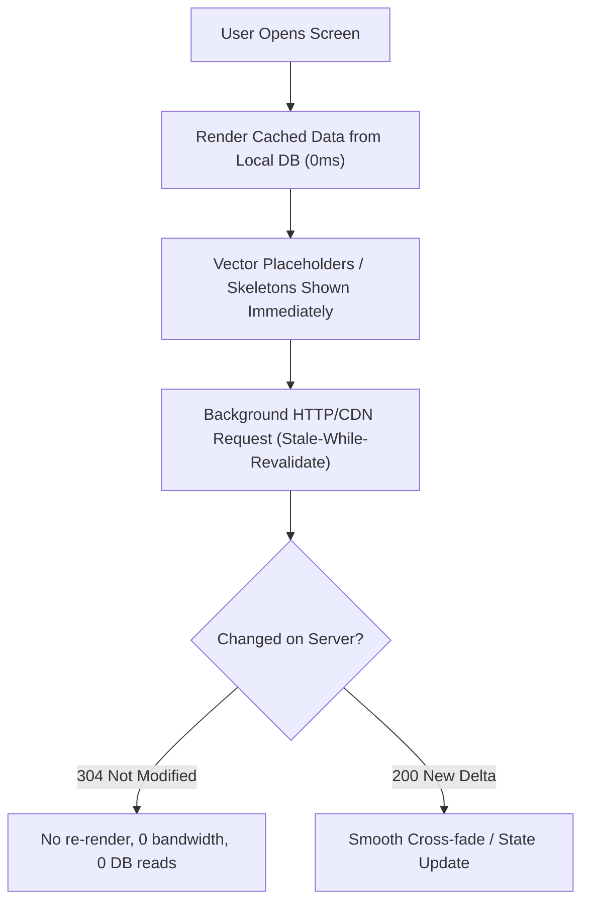

# Hyper-Local App Scalability & Performance Engineering Guide
> **Architectural Blueprint inspired by BigBasket, Blinkit, Zepto, Uber, Swiggy & Urban Company**  
> *Targeted for DutyPe: Achieving sub-100ms response times, 120 FPS UI fluidity, zero server crashes, and cost-efficient cloud scalability.*

---

## Core Philosophy: "Zero-Latency" Perception

> **Rule of Thumb in Hyper-local Engineering**: Never make the user wait for a network roundtrip (200–800ms) before rendering UI. The app must render from local memory in **0ms**, and sync deltas asynchronously in the background.



---

## 12 Production Engineering Patterns Used by Top Apps

---

### 1. Stale-While-Revalidate (SWR) Local-First Architecture

* **The Problem**:  
  If an app fetches jobs or services from Firestore every time the worker navigates to Home, the screen displays a blank screen or a white loading spinner for 1–2 seconds. In poor connectivity or 2G/3G zones, requests time out or fail completely.
* **How BigBasket / Blinkit solves it**:
  - The phone stores the last-seen jobs/catalog in local SQLite/Room or encrypted device cache.
  - When the user opens the screen: **render cached data in 2 milliseconds**. The user can immediately read job titles, wages, categories, and company names.
  - In the background, fetch fresh jobs. If nothing changed, do nothing. If new jobs arrived, seamlessly animate the new cards into the list.
* **DutyPe Implementation**:
  - Store active job feeds and category definitions in Room or DataStore cache.
  - Home screen always loads immediately offline or on poor network connections without blocking the user.

---

### 2. CDN Edge Caching (Preventing Firebase Overload & Bill Surges)

* **The Problem**:  
  Firestore charges **$0.06 per 100,000 document reads**.
  - If 50,000 users open DutyPe and fetch 20 job cards each day:
    $$\text{Reads} = 50{,}000 \times 20 = 1{,}000{,}000 \text{ reads/day}$$
  - This spikes Firebase bills and creates unnecessary database reads on frequently read, slow-changing data.
* **How BigBasket / Zepto solves it**:
  - 85% of reads (Home Service Catalog, Featured Banners, Categories, Popular Job Listings) are identical for all users in the same city.
  - Instead of hitting the database directly, requests go through **Cloudflare / Firebase CDN Cache** with `Cache-Control: public, max-age=30, s-maxage=120`.
  - 10,000 users requesting the service catalog within 2 minutes generate **exactly 1 database read**. The remaining 9,999 requests are served by the CDN in **~15ms** from edge servers in Hyderabad/Chennai/Mumbai.

---

### 3. Image Micro-Thumbnails (`_thumb.webp`)

* **The Problem**:  
  When employers upload shop/worksite photos from modern phones, camera files are **3MB to 8MB JPEG/PNG**. Downloading 10 of these in a list consumes 50MB of user data and causes noticeable scroll lag (jank / dropped frames).
* **How Blinkit / Swiggy solves it**:
  - **On Client (Before Upload)**: Compress the photo using Android Bitmap compression to max 800px width (under 120KB).
  - **On Server (Cloud Function trigger on Storage)**: Generate two files:
    1. `thumb_120x120.webp` (5KB to 10KB) — Used strictly in job cards, search lists, and history tiles.
    2. `full_800x800.webp` (50KB to 90KB) — Downloaded only when the user taps to view full-screen photos.
  - **Result**: Scrolling through 50 cards costs less than **300KB** of total mobile data.

---

### 4. Geohash Spatial Clustering (Hyper-local Bounding Boxes)

* **The Problem**:  
  Querying `WHERE lat BETWEEN ... AND lng BETWEEN ...` across a large database requires continuous mathematical computations that slow down servers and cannot be natively indexed cleanly in document databases.
* **How Uber, Zepto, and Urban Company solve it**:
  - Convert coordinates $(lat, lng)$ into a **Geohash string** (e.g., `tg7k2` for Khammam).
  - Both worker profiles and posted jobs store `geohash5` (~4.9km radius) and `geohash6` (~1.2km radius).
  - Searching for nearby jobs is a simple string prefix match:
    ```typescript
    db.collection("jobs")
      .where("geohash5", "==", userGeohash5)
      .where("status", "==", "OPEN")
      .limit(20)
    ```
  - This executes on indexed B-trees in under **5ms** without heavy geospatial math.

---

### 5. Stable Keys & Frame-Drop Pruning in Jetpack Compose (120 FPS)

* **The Problem**:  
  In Jetpack Compose, when any single item updates or scrolling accelerates, Compose can re-evaluate the entire list. On budget Android devices (Redmi 9, Vivo Y-series, Realme C-series), this causes noticeable frame drops below 30 FPS.
* **How BigBasket optimizes Compose lists**:
  1. **Strict Keys**: Always provide `key = { job.id }` in `items()`:
     ```kotlin
     LazyColumn {
         items(items = jobs, key = { it.id }) { job ->
             WorkerJobCard(job = job)
         }
     }
     ```
  2. **Sub-composition skipping**: Mark UI state models as `@Immutable` or `@Stable`.
  3. **Deferred Layout Reading**: Never read scroll state or dynamic offsets in Compose composition; use lambda modifiers (`Modifier.offset { ... }`) so only the draw phase runs, skipping layout and recomposition.

---

### 6. Idempotency Keys (Preventing Double Bookings & Duplicate Payments)

* **The Problem**:  
  In weak connectivity, an employer taps "Book Service" or "Post Job", the network hangs for 5 seconds, and they tap it 2 more times. Without protection, 3 bookings are created or money is deducted twice.
* **How Swiggy / Uber solves it**:
  - Whenever the user initiates an action, generate a unique UUID on the phone:
    ```kotlin
    val idempotencyKey = "book_${userId}_${System.currentTimeMillis() / 60000}"
    ```
  - Pass this key in the request payload.
  - The backend uses a transaction:
    - If `idempotencyKey` was processed within the last 5 minutes, return the existing booking ID without re-running payments or creating duplicate database documents.

---

### 7. Exponential Backoff with Jitter & FCM Silent Wakeups

* **The Problem**:  
  When a network outage ends, 10,000 devices reconnect and retry requests at the exact same second, inadvertently causing a self-inflicted denial-of-service (thundering herd) on the backend.
* **The Production Fix**:
  - **Exponential Backoff with Jitter**:
    $$T_{\text{wait}} = 2^{\text{attempt}} + \text{random}(0, 1000)\text{ ms}$$
    This spreads reconnect traffic evenly across a rolling window.
  - **FCM Silent Data Messages Instead of Polling**:
    - Never use `setInterval` or polling loops to check if a booking was accepted.
    - Keep devices idle until a silent push notification (`content_available: true`) triggers the device to update its cache. Battery consumption remains minimal.

---

### 8. Heavy / Light Collection Splitting (`jobmetadata` vs `jobs`, `worker_cards` vs `worker_profiles`)

* **The Problem**:  
  Storing entire entities (full job descriptions, employer address, internal notes, audit timestamps) inside a single collection document bloats list queries. Loading 20 jobs transfers 100KB+ over cellular networks, parsing large JSON maps in mobile memory.
* **How Urban Company / Blinkit / DutyPe solves it**:
  - **Split documents into two tiers**:
    1. **Lightweight Metadata Projection (`jobmetadata` / `worker_cards`)**:
       - Contains strictly what the list view needs: `title`, `salary`, `category`, `geohash5`, `thumbnailUrl`, `status`.
       - Document size: **~300 bytes**.
       - A list of 30 cards consumes less than **10KB total bandwidth**.
    2. **Detailed Document (`jobs` / `worker_profiles`)**:
       - Contains full description, employer contact details, requirements, exact coordinates, audit history.
       - Fetched **only** when the user taps on an individual card to open Job Details.
  - **Speedup**: List loads 10x faster with 90% less egress bandwidth.

---

### 9. Document Sharded Counters (Bypassing Firestore's 1-Write/Sec Limit)

* **The Problem**:  
  Firestore documents have a physical throughput ceiling of **1 write per second**. If a popular job goes viral in Khammam and 200 workers apply or view within 10 seconds, incrementing `views` or `applicantsCount` on that single document throws `ABORTED` or `RESOURCE_EXHAUSTED`.
* **How Top Apps solve it**:
  - Distribute writes across $N$ sub-document shards (e.g. 5 shards):
    `jobs/{jobId}/shards/{1..5}`
  - When recording a view or applicant increment:
    ```typescript
    const shardId = Math.floor(Math.random() * 5) + 1;
    await db.doc(`jobs/${jobId}/shards/${shardId}`).set(
      { count: admin.firestore.FieldValue.increment(1) },
      { merge: true }
    );
    ```
  - Reads sum up the 5 shards, allowing 50+ concurrent writes per second without locking.

---

### 10. Tiered Cold Storage Lifecycle Archiving (Firestore Hot Tier → Cosmos DB / Cold Tier)

* **The Problem**:  
  Over months, millions of completed, canceled, or expired jobs, along with AI audit logs, accumulate in the operational database. This expands Firestore collection size, increases backup costs, and slows query planning.
* **Production Fix**:
  - **Hot Tier (Firestore)**: Strictly active documents (jobs with `status == "OPEN"` less than 30 days old).
  - **Cold Tier (Azure Cosmos DB / Cloud Storage Archive)**:
    - Scheduled Cloud Function runs daily at 02:00 UTC.
    - Archives closed jobs, past applications, and AI logs older than 30 days into Azure Cosmos DB NoSQL.
    - Purges the expired documents from Firestore hot tier.
  - **Result**: Firestore collection remains lean and indexed query speeds stay constant over years.

---

### 11. Optimistic UI Mutations with Offline Room Action Queues

* **The Problem**:  
  When a user taps "Apply to Job", "Save Bookmark", or "Accept Request", waiting for backend roundtrip leaves buttons in loading state for 1–3 seconds, feeling sluggish.
* **How Uber & Swiggy solve it**:
  - **0ms Optimistic State**: Change UI button state to "Applied" / "Saved" instantly upon finger touch.
  - Write mutation into local Room database with sync status `PENDING`.
  - Background coroutine or WorkManager flushes mutations to Cloud Functions in FIFO order.
  - If a permanent rejection occurs (e.g., job already filled), gracefully rollback the local state with an informative snackbar.

---

### 12. Client-Side & Server-Side Token Bucket Rate Limiting (OTP & Search)

* **The Problem**:  
  Repeated clicks on "Send OTP" or rapid search input can exhaust third-party SMS/WhatsApp provider quotas and run up substantial messaging bills.
* **Production Fix**:
  - **Client-Side**:
    - Debounce search input by 300ms.
    - Enforce a 60-second cooldown timer on WhatsApp OTP, while allowing instant SMS fallback if WhatsApp is unreachable.
    - Reuse existing OTP session token if user navigates back and submits within the 10-minute expiry window.
  - **Server-Side**:
    - Token-bucket rate limiting per IP and phone number in Cloud Functions: maximum 3 OTP sends per 15 minutes, maximum 5 verification attempts per OTP session.

---

## Implementation Priority for DutyPe

| Priority | Technique | Implementation Effort | Primary Benefit |
| :--- | :--- | :--- | :--- |
| **P0 (Immediate)** | **Image Pre-sizing & Vector Placeholders** | Completed | 0ms layout shift, instant visual feedback |
| **P0 (Immediate)** | **Strict Compose Keys (`items(jobs, key = { it.id })`)** | Completed | Prevents scroll lag & frame drops on budget phones |
| **P0 (Immediate)** | **Heavy / Light Split (`jobmetadata` vs `jobs`)** | Architecture In Place | 90% reduction in list transfer payload & instant feed load |
| **P1 (Launch)** | **Idempotency Keys on Booking/Hiring** | Moderate | Prevents duplicate payments and duplicate bookings |
| **P1 (Launch)** | **Client-Side WebP Compression (<120KB on upload)** | Moderate | Saves 90% mobile data and storage costs |
| **P1 (Launch)** | **Enforce App Check Exception on Critical Callables** | Completed | Prevents legitimate users from getting blocked with 401 |
| **P2 (Scale)** | **CDN Caching for Public Catalog & Offers** | Moderate | Drops Firestore read costs to near-zero |
| **P2 (Scale)** | **Local-First SWR Cache for Home Feed** | Medium | App opens in under 100ms even with poor connectivity |
| **P2 (Scale)** | **Tiered Cold Storage Archiving (Azure Cosmos DB)** | Moderate | Keeps operational database light and costs bounded |
| **P2 (Scale)** | **Document Sharded Counters for High-Traffic Jobs** | Low | Eliminates 1-write/second bottleneck during peak demand |
